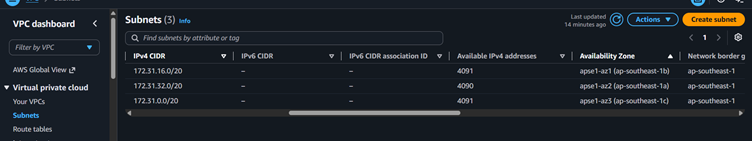
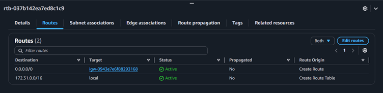
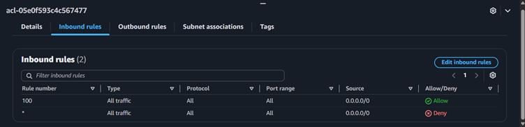
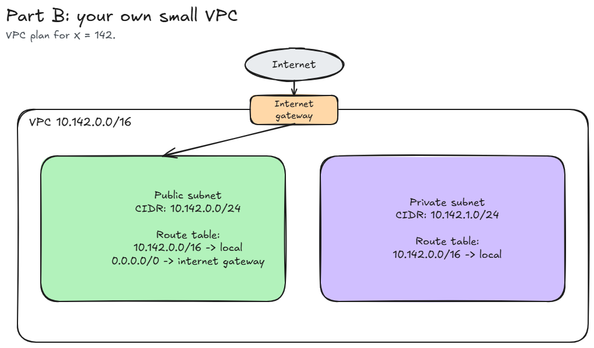

# Assignment 2 Submission

## About me

- GitHub username: shamKirzon
- Section: IV-CCSAD
- IAM user name that I signed in with: `ccsad-g08`
- X: 142

---

## Part A. Explore

### A1. The VPC

Default VPC IPv4 CIDR:

`172.31.0.0/16`

Number of addresses in that CIDR:

65,536

### A2. The subnets

| Availability Zone | IPv4 CIDR |
| --- | --- |
| `ap-southeast-1a` | `172.31.32.0/20` |
| `ap-southeast-1b` | `172.31.16.0/20` |
| `ap-southeast-1c` | `172.31.0.0/20` |

Screenshot 1. Save it as `screenshot-1-subnets.png` in your folder. The image line below shows it.

### A3. Available addresses

Available IPv4 addresses in each subnet:

`ap-southeast-1a` 4,090, `ap-southeast-1b` 4,091, `ap-southeast-1c` 4,091.

Why is the number lower than 4,096?

Each subnet is a `/20`, so it has 4,096 addresses. AWS keeps 5 of them in every subnet for its own use, so an empty subnet shows 4,096 - 5 = 4,091 available addresses.

What uses the missing address in the subnet with the lowest number?

`ap-southeast-1a` shows 4,090, which is one less than the other two. One more address is in use there. A network interface holds one address from its subnet, so one network interface (for example, an instance or another resource) is using that address.

### A4. The route table

| Destination | Target |
| --- | --- |
| `0.0.0.0/0` | `igw-...` |
| `172.31.0.0/16` | `local` |

Screenshot 2. Save it as `screenshot-2-routes.png` in your folder. The image line below shows it.

### A5. Public or private

Are the default subnets public or private? Which route proves it?

Public. The route `0.0.0.0/0` sends traffic to the internet gateway (`igw-...`), and a subnet with that route is a public subnet.

### A6. The internet gateway

State of the internet gateway:

Attached

What happens to the default subnets if the gateway is detached?

The `0.0.0.0/0` route to the internet gateway no longer has a working target, so the default subnets lose their route to the internet. Instances cannot reach the internet and the internet cannot reach them. The `local` route is not affected, so the subnets can still reach each other inside the VPC.

### A7. NAT gateways

Number of NAT gateways:

0

Can a server in a new private subnet download updates? Why?

No. A new private subnet has no NAT gateway to send its internet traffic through, and its route table has only the local route. It has no `0.0.0.0/0` route, so the server cannot start a connection to the internet. It could download updates only after a NAT gateway exists in a public subnet and the private route table sends `0.0.0.0/0` to it.

### A8. The network ACL

| Rule number | Source | Allow or Deny |
| --- | --- | --- |
| 100 | `0.0.0.0/0` | Allow |
| `*` | `0.0.0.0/0` | Deny |

How is a network ACL different from a security group?

A network ACL protects a whole subnet, while a security group protects one resource such as an instance. A network ACL has both allow and deny rules, and checks them by rule number, lowest first. A security group has allow rules only. A network ACL is stateless, so replies need their own outbound rule, but a security group is stateful, so replies go out without a rule.

Screenshot 3. Save it as `screenshot-3-network-acl.png` in your folder. The image line below shows it.

### A9. The default security group

Inbound rule (type and source):

All traffic, from `sg-...`. The source is the `default` security group itself.

Which resources can send traffic to an instance that uses it?

Only resources that also use the `default` security group. There is no other inbound rule, so traffic from every other source is blocked.

---

## Part B. Prepare

### B1. Plan two subnets

- Public subnet CIDR: `10.142.0.0/24`
- Private subnet CIDR: `10.142.1.0/24`

### B2. Route tables

Route table of the public subnet:

| Destination | Target |
| --- | --- |
| `10.142.0.0/16` | `local` |
| `0.0.0.0/0` | internet gateway |

Route table of the private subnet:

| Destination | Target |
| --- | --- |
| `10.142.0.0/16` | `local` |

### B3. My VPC diagram

Tool used (Excalidraw, draw.io, Lucidchart, or paper):

Excalidraw

### B4. Predict a change

Can you still open the web page from your laptop? Why?

No. The route `0.0.0.0/0` is what sends traffic to the internet gateway. Without it, the traffic between my laptop (on the internet) and the instance has no matching route, so the page does not load. The public IP address alone is not enough.

Can the instance still reach another instance in the VPC? Why?

Yes. The `local` route for the VPC range `172.31.0.0/16` is still in the route table, and it covers traffic between instances in the same VPC. Deleting `0.0.0.0/0` does not affect it.

### B5. Place a database

Which subnet gets the database? Why?

The private subnet (`10.142.1.0/24`). It has no route to the internet gateway, so nobody on the internet can reach the database directly. Only resources inside the VPC can reach it through the local route.

### B6. My question about VPCs

What is your question, and what made you think of it?

In A3, one default subnet had 4,090 available addresses while the other two had 4,091. If I stop an instance in a subnet, does its address become available again, or does it stay used? The README says a stopped instance still uses one address, and I want to know how that affects planning a small subnet like a `/28`.
